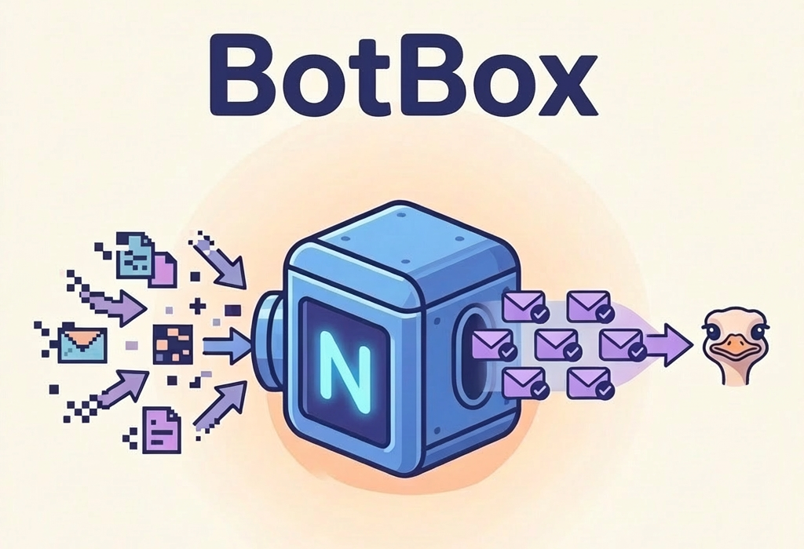

# BotBox



A browser extension for bringing consistency to your chaotic relays.

Botbox continuously monitors your inbox and outbox relays:

- It makes sure all your events are available according the [Outbox Model](https://www.whynostr.org/post/8yjqxm4sky-tauwjoflxs/)
- Allows to scan a big list of relays looking for orphan events you should have received
- (....WIP)

## Browser Support

✅ **Chrome and other Chromium browsers** (Manifest V3)  
✅ **Firefox and LibreWolf** (Manifest V2)  

### Installation

#### Chrome/Edge/Brave

1. Build the extension: `npm run build:chrome`
2. Open `chrome://extensions/` (or `edge://extensions/`, `brave://extensions/`)
3. Enable "Developer mode" (toggle in top right)
4. Click "Load unpacked"
5. Select the `dist-chrome/` directory from the project

#### Firefox

1. Build the extension: `npm run build:firefox`
2. Open `about:debugging#/runtime/this-firefox`
3. Click "Load Temporary Add-on"
4. Select the `dist-firefox/botbox-firefox.xpi` file (or any file in `dist-firefox/`)

## Development

### Build Commands

```bash
# Build for Chrome (Manifest V3)
npm run build:chrome

# Build for Firefox (Manifest V2) 
npm run build:firefox
```

### Prerequisites

- Node.js 20.19+ or 22.12+ (we recommend using nvm)
- npm or yarn
- A NIP-07 compatible browser extension (Alby, nos2x, etc.)

### Setup

1. Clone the repository:
```bash
git clone <repository-url>
cd nostr-agenda
```

2. Install Node.js 22 (if using nvm):
```bash
nvm install 22
nvm use 22
```

3. Install dependencies:
```bash
npm install
```

4. Build the extension:
```bash
npm run build
```

The built extensions will be in the `dist-chrome/` and `dist-firefox/` directories.

### Contributing

Contributions are welcome! Please feel free to submit issues or pull requests.

## License

MIT License - see LICENSE file for details

## Credits

Built with:
- [nostr-tools](https://github.com/nbd-wtf/nostr-tools) - Nostr protocol utilities
- [Svelte](https://svelte.dev/) - UI framework
- [Vite](https://vitejs.dev/) - Build tool
- [TypeScript](https://www.typescriptlang.org/) - Type safety

## Links

- [Nostr Protocol](https://github.com/nostr-protocol/nostr)
- [NIPs Repository](https://github.com/nostr-protocol/nips)
